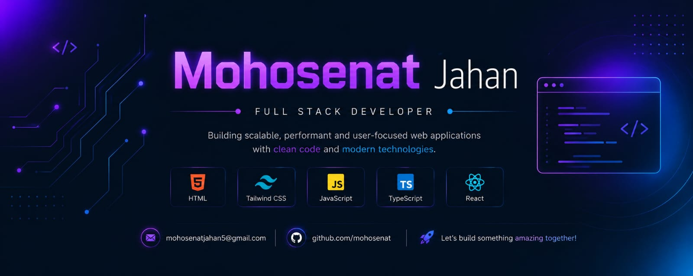

  

<h1 align="center">Hi 👋, I'm Mohosenat Jahan</h1>

<h3 align="center">
  🚀 Aspiring Full-Stack Developer | Building Real-World Projects | Exploring React.js & AI
</h3>

  
  
  
  

---

## 👨‍💻 About Me

I’m an aspiring **Full-Stack Developer** passionate about building modern, responsive, and user-friendly web applications. I enjoy turning ideas into real-world projects and continuously improving my problem-solving and development skills.

Currently, I’m strengthening my skills in **JavaScript, TypeScript, and React.js** while exploring modern web technologies and the possibilities of **AI in web development**.

I believe in learning by building, experimenting with new technologies, and improving through consistent practice.

---

## 🔭 What I'm Currently Doing

* 🚀 Building real-world web development projects
* ⚛️ Exploring **React.js** and modern frontend development
* 📘 Strengthening my **JavaScript & TypeScript** skills
* 🎨 Improving responsive and user-friendly UI development
* 🧠 Practicing problem-solving and logical thinking
* 🤖 Exploring **AI and its applications in web development**
* 🌱 Working toward becoming a professional **Full-Stack Developer**

---

## 🛠️ Skills & Technologies

### 💻 Languages

  

### ⚛️ Frontend Development

  

### 🔧 Tools & Development Environment

  

---

## 📚 Currently Learning

  

I’m currently focusing on:

* Modern JavaScript development
* TypeScript
* React.js
* Responsive web development
* Full-Stack development concepts
* AI-powered web applications

---

## 🚀 My Development Journey

My journey started with the fundamentals of **HTML and CSS**, followed by **JavaScript** and **TypeScript**.

As I continue to grow, I’m focusing more on building practical projects rather than only learning theory. My current goal is to strengthen my frontend development skills with **React.js** and gradually move toward full-stack development.

> **Learn → Build → Improve → Repeat 🔄**

---

## 🎯 2026 Goals

* 🚀 Become confident with React.js
* 💻 Build more real-world projects
* 🧠 Improve problem-solving skills
* 📚 Strengthen JavaScript & TypeScript fundamentals
* 🌐 Build a strong professional portfolio
* 🤖 Explore AI integration in web applications
* 🔥 Maintain consistency on GitHub
* 🤝 Collaborate and learn from other developers

---

## 📊 GitHub Statistics

  

---

## 🔥 GitHub Streak

  

---

## 🐍 Contribution Activity

  

---

## ⭐ Featured Projects

### 🌐 Project One

**Short Description:**
A modern web application designed to provide a responsive, user-friendly, and engaging experience.

**Tech Stack:**
`HTML` `CSS` `JavaScript`

🔗 **Live Demo:** YOUR_LIVE_LINK
📂 **Repository:** YOUR_REPOSITORY_LINK

---

### ⚡ Project Two

**Short Description:**
A practical web development project focused on clean UI, responsive design, and real-world functionality.

**Tech Stack:**
`HTML` `CSS` `JavaScript` `TypeScript`

🔗 **Live Demo:** YOUR_LIVE_LINK
📂 **Repository:** YOUR_REPOSITORY_LINK

---

## 🤝 Let's Connect

  

  

  

  

---

## 💡 My Philosophy

> **“Consistency beats perfection. Every project is an opportunity to learn, build, and improve.”**

I’m always looking forward to learning new technologies, building meaningful projects, collaborating with developers, and growing as a software developer.

---

  <b>Thanks for visiting my profile! 🚀</b>

  <i>Keep Learning • Keep Building • Keep Growing</i>

